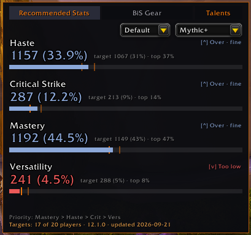
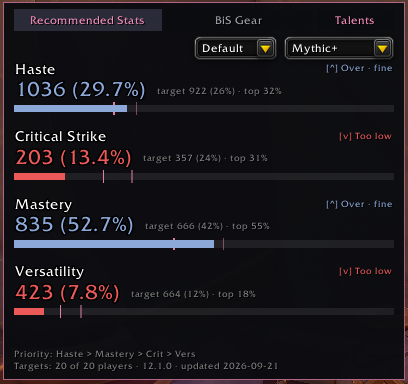
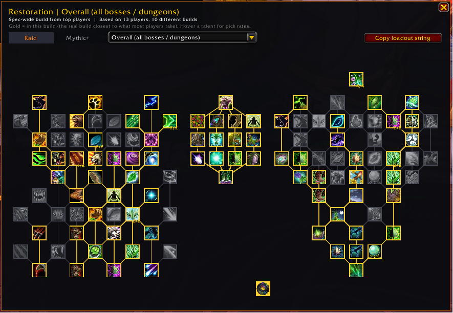
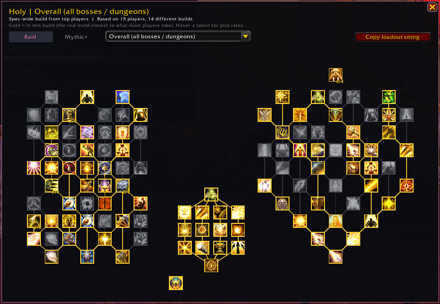
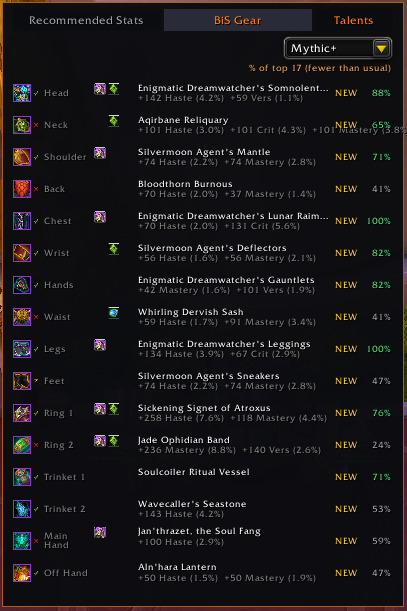
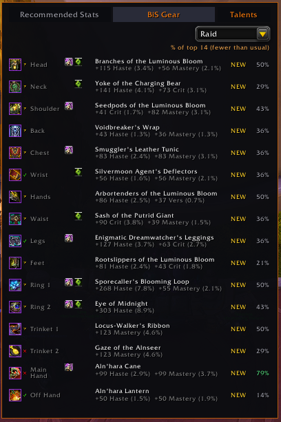
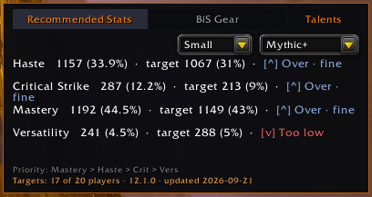
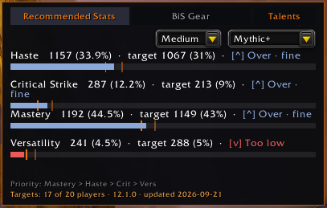
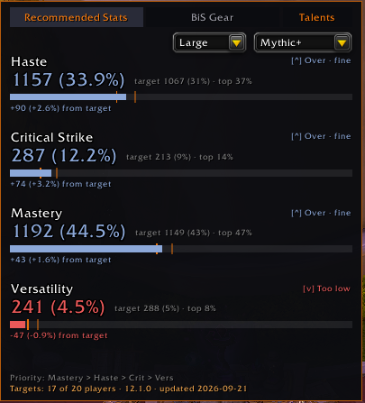
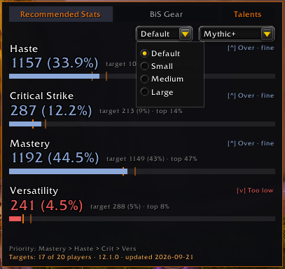

# RecommendedStats

A World of Warcraft addon that shows your secondary stats (Haste, Critical Strike, Mastery, Versatility) against targets pulled from top players for your class and spec, plus a best-in-slot gear list and the talent builds top players run for every boss and dungeon, right on the character screen.

## Features

- **Stat panel** docked next to the character screen, showing current vs. target for each secondary stat, with a progress bar and a target tick so you can see how far off you are, not just whether you're over or under.
- **Raid / Mythic+ toggle** so targets match the content you're actually doing.
- **BiS gear panel** listing the best item per slot for your class, spec, and content, with a tooltip on hover and a "% of top players using this" figure.
- **Top player talents** in their own window, opened from the Talents button next to the tabs: the full talent tree for your spec with the build most top players agree on, per boss (Raid) or per dungeon (Mythic+), plus a one-click copy of the loadout string to import in game.
- **Minimap button**: left-click to show or hide both panels, right-click to open options.
- **Movable panels**: attach to the character screen by default, or detach and drag them anywhere. Positions are remembered per character.
- **Slash commands** for quick control without touching the mouse.

## Screenshots

**Talents**: the Talents button sits beside the Recommended Stats and BiS Gear tabs and opens the talents window.

The window shows your spec's class, hero and spec trees with the top-player build highlighted in gold. Switch between Raid and Mythic+ at the top, pick a boss or dungeon from the dropdown, and hover any talent to see how many players take it.

| Restoration Druid | Holy Paladin |
|---|---|
|  |  |

**BiS Gear**, with enchant/gem indicators and item-level-aware status dots:

| Mythic+ | Raid |
|---|---|
|  |  |

**Row size**, from a single compact line up to a full readout with a delta-from-target line, picked from the dropdown next to the Raid/Mythic+ toggle or from Options:

| Small | Medium |
|---|---|
|  |  |

| Large | Picking a size |
|---|---|
|  |  |

## Installation

1. Download the latest release (or clone this repo) into your WoW `Interface/AddOns` folder so you end up with `Interface/AddOns/RecommendedStats/RecommendedStats.toc`.
2. Restart WoW or reload your UI (`/reload`).
3. Enable RecommendedStats in the AddOns list if it isn't already.

## Usage

Open your character screen (`C`) and the stat panel appears automatically, with the BiS gear panel docked beside it.

**Minimap button**
- Left-click: show/hide both panels
- Right-click: open options

**Talents**

Click the **Talents** button next to the tabs (or type `/rs talents`) to open the talents window.

1. Choose **Raid** or **Mythic+** at the top.
2. Pick **Overall** for your spec's general build, or a specific boss or dungeon from the dropdown.
3. Hover any talent to see how many top players take it. Choice talents show the split for each option.
4. Press **Copy loadout string**, then paste it into the game's talent **Import** to apply the build.

The window is movable, remembers its position, and closes with Escape.

**Slash commands**

| Command | Effect |
|---|---|
| `/rs` | Print the current content setting |
| `/rs raid` | Show targets for Raid |
| `/rs mythicplus` (or `/rs m+`) | Show targets for Mythic+ |
| `/rs resetpos` | Reset panel positions back to their default dock point |
| `/rs talents` | Open or close the talents window |
| `/rs options` | Open the options panel |

## Options

Available via Esc > Options > AddOns > RecommendedStats, or `/rs options`, or right-clicking the minimap button.

- **Panel position**: attach to the character screen, or leave unattached so it can be moved and shown independently.
- **Show BiS gear section**: toggle the BiS panel on or off.

## How targets are calculated

Stat targets and BiS gear are built from a sample of top players per class, spec, and content type (raid or Mythic+), sourced from raider.io and the Battle.net API. The current data set is built from a sample of up to 20 players per spec and is refreshed as new content and patches land, the exact sample size and last-updated date are shown in the footer of the stat panel.

Stats are compared as:
- **Too low**: noticeably under target
- **On target**: within half a percentage point of target
- **Over, fine**: above target, which isn't a problem, it just means the point could be better spent elsewhere

## How talent builds are chosen

Talent builds come from top players' real loadouts: Mythic+ runs (per dungeon) and raid kills (per boss) from raider.io, plus a spec-wide build from the same sample used for stat targets.

- **The highlighted build is a real player's build**, the one that agrees most with what the group takes overall, so it is always valid and importable. A "most popular talent" mash-up could break choice talents or the point cap.
- **Pick rates** in each talent's tooltip show how many of the sampled players take it.
- **Not enough data for a boss or dungeon?** You'll see your spec's overall build instead, and the dropdown marks those entries "(overall build)". Raid bosses fall back from Mythic to Heroic to Normal kills first, and the dropdown shows which difficulty you're looking at.
- **Raid and Mythic+ never stand in for each other**, since the two are built for different things.
- Late bosses can have few kills early in a tier, so they may show the overall build until more data comes in.

## A note on combat and instances

Blizzard's Secret Values system restricts reading exact stat values while you're in an instance or in combat. When that happens, RecommendedStats still shows your current value and the progress bar, it just can't render a "too low / on target / over" verdict until the restriction lifts.

## Supported classes and specs

All current class/spec combinations are supported. If you find a spec with no data yet for your content type, the panel will say so rather than showing stale or wrong numbers.

## Feedback and issues

Found a bug, a spec with missing data, or a suggestion? Open an issue on this repo.

## Contributing a translation

RecommendedStats doesn't have a translation for your language yet? Contributions are welcome.

1. Copy `RecommendedStats/Locale/enUS.lua` as your starting point.
2. Change the locale guard at the top of the copy to your client's locale code (e.g. `deDE`, `frFR`, `zhCN`) and translate the text on the right-hand side of each `L.KEY = "..."` line — leave the keys themselves untouched.
3. Every `%s`, `%d`, `%.0f%%`, etc. in a line has to appear the same number of times, in the same order, as the English original. These get filled in with real values (dates, percentages, item names) at runtime, and a missing or mismatched one causes an in-game error rather than a display glitch.
4. Send the finished file as an issue or PR on this repo, or reach out directly.

New locale files only activate for players running that client locale, so a translation can never affect anyone using a different one.

## License

MIT
